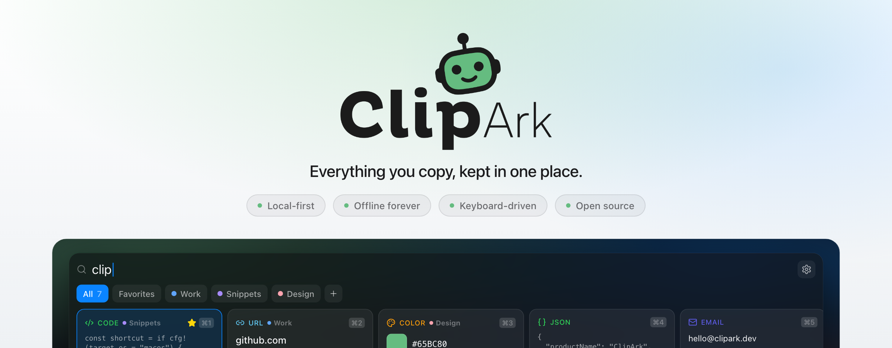
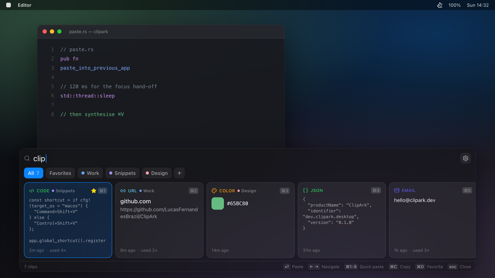
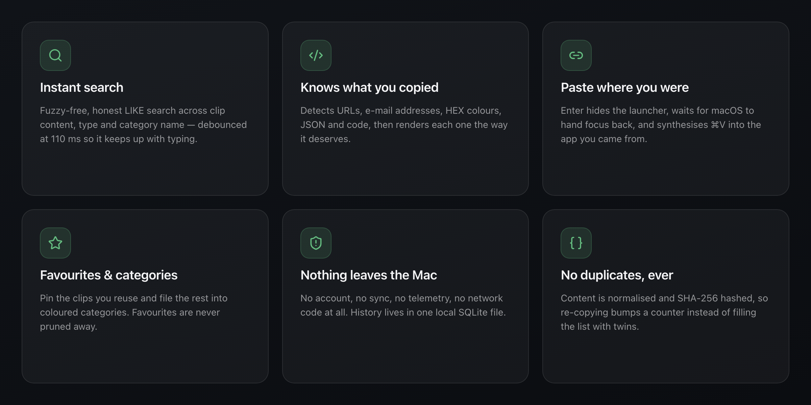
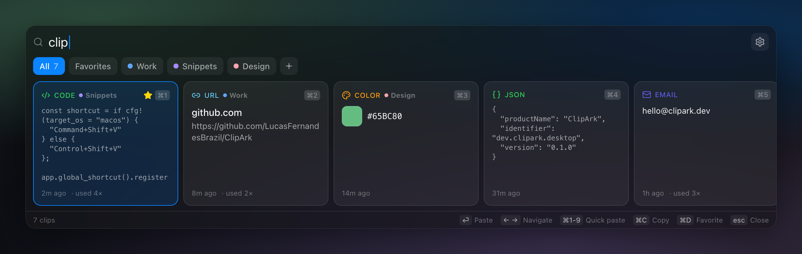
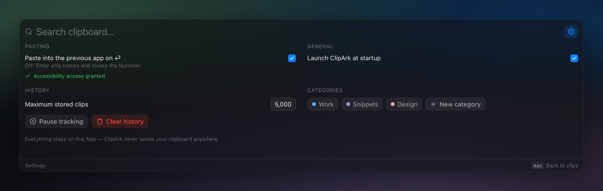
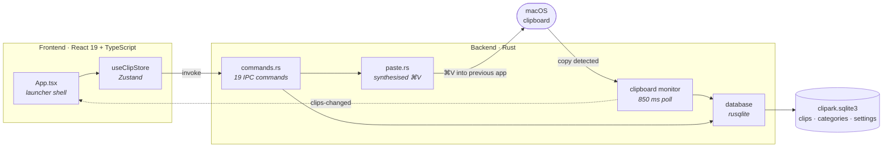

<div align="center">

<picture>
  <source media="(prefers-color-scheme: dark)" srcset="docs/assets/hero-dark.png">
  <source media="(prefers-color-scheme: light)" srcset="docs/assets/hero-light.png">
  
</picture>

<p>
  <strong>A local-first clipboard manager for macOS.</strong><br>
  Everything you copy, kept in one place — searchable, categorised, and never leaving your Mac.
</p>

<p>
  <a href="https://github.com/LucasFernandesBrazil/ClipArk/releases/latest"></a>
  <a href="#-quick-start"></a>
  <a href="LICENSE"></a>
  
  
  
  
  
</p>

<p>
  <a href="#-why-clipark">Why</a> ·
  <a href="#download">Download</a> ·
  <a href="#-quick-start">Quick start</a> ·
  <a href="#-features">Features</a> ·
  <a href="#-auto-paste">Auto-paste</a> ·
  <a href="#-keyboard">Keyboard</a> ·
  <a href="#-privacy">Privacy</a> ·
  <a href="#-architecture">Architecture</a> ·
  <a href="#-contributing">Contributing</a>
</p>

<sub><a href="README.md">English</a> · <a href="README.pt-BR.md">Português (BR)</a></sub>

</div>

---

## 🤔 Why ClipArk

macOS remembers exactly one thing you copied. Everything before that is gone.

ClipArk keeps the rest. Press <kbd>⌘</kbd><kbd>⇧</kbd><kbd>V</kbd> and a bar slides up from the
bottom of your screen with everything you've copied recently — searchable, typed, and
categorised. Pick one, hit <kbd>⏎</kbd>, and it is pasted straight back into the app you
were in.

It has no account, no sync, no telemetry and **no network code at all**. Your clipboard
history lives in a single SQLite file on your own machine, and that is the whole design.

<div align="center">
  
  <sub>ClipArk has no Dock icon — it lives in the menu bar and docks to the bottom of the active display.</sub>
</div>

---

## 🚀 Quick start

### Download

Grab the latest `.dmg` from the
**[Releases page](https://github.com/LucasFernandesBrazil/ClipArk/releases/latest)** — one
universal build, Apple silicon and Intel, macOS 11 or newer. No clone, no toolchain.

1. Open the `.dmg` and drag **ClipArk** into `Applications`.
2. Launch it — see [Opening an unverified build](#opening-an-unverified-build) below,
   because macOS will block the first attempt.
3. Grant **Accessibility** access when prompted if you want <kbd>⏎</kbd> to paste for you.

#### Opening an unverified build

Releases are signed ad-hoc, but there is no paid Apple Developer ID behind ClipArk, so
they are not notarised. macOS blocks the first launch with:

> **Apple could not verify "ClipArk" is free of malware that may harm your Mac or
> compromise your privacy.**

That message is about notarisation, not about the app. Apple scans notarised builds and
vouches for them, and that scan costs a $99/year developer membership nobody has paid.
Nothing here was inspected and found wanting — it was never submitted.

Getting past it takes two steps, once per version:

1. Double-click **ClipArk**, then press **Done** on the dialog.
2. Open **System Settings → Privacy & Security**, scroll down to *Security*, and press
   **Open Anyway** on the ClipArk line that has just appeared. Confirm with Touch ID or
   your password.

On macOS 15 and newer that is the only reliable path — the old right-click → *Open*
shortcut no longer always works. If you prefer the terminal, stripping the quarantine flag
skips the dialog altogether:

```bash
xattr -dr com.apple.quarantine /Applications/ClipArk.app
```

> [!TIP]
> A build that refuses to open at all with *"ClipArk is damaged and can't be opened"* — a
> dialog with no **Open Anyway** button — predates ad-hoc signing. Download the latest
> release; that one is fixed and should not come back.

Every release ships a `SHA256SUMS.txt`, so you can verify the download first:

```bash
shasum -a 256 -c SHA256SUMS.txt
```

> [!NOTE]
> macOS ties Accessibility permission to the exact binary it was granted to. An ad-hoc
> signature changes with every build, so **you may need to re-grant Accessibility access
> after updating.**
> Remove the old ClipArk entry under *System Settings → Privacy & Security →
> Accessibility* and add the new one — a stale entry silently does nothing.

### Build from source

**Prerequisites**

| | |
|---|---|
| Node.js | 18 or newer, with npm |
| Rust | stable toolchain via [rustup](https://rustup.rs) |
| Xcode CLT | `xcode-select --install` |

**Build and run**

```bash
git clone https://github.com/LucasFernandesBrazil/ClipArk.git
cd ClipArk
npm install
npm run tauri dev
```

To produce an app bundle instead:

```bash
npm run tauri build
```

The result lands in `src-tauri/target/release/bundle/`. Local builds are **unsigned**;
releases are signed ad-hoc, which is what stops macOS calling them damaged. To match:

```bash
APPLE_SIGNING_IDENTITY=- npm run tauri build
```

Either way the build is not notarised, so macOS still blocks the first launch — see
[Opening an unverified build](#opening-an-unverified-build).

**First run**

1. ClipArk starts in the menu bar. There is no Dock icon and no ⌘-Tab entry — that is
   deliberate, and it is what lets auto-paste hand focus back to your previous app.
2. Press <kbd>⌘</kbd><kbd>⇧</kbd><kbd>V</kbd> to open the launcher.
3. Grant **Accessibility** access when prompted, or from *Settings → Pasting*. Without it
   ClipArk still copies; it just cannot paste for you. See [Auto-paste](#-auto-paste).

---

## ✨ Features

<div align="center">
  
</div>

### Capture

- A background thread polls the system clipboard every **850 ms**. Text only for now —
  images and files are on the [roadmap](#-roadmap).
- Every clip is **normalised** (lowercased, CRLF → LF, whitespace collapsed) and hashed
  with **SHA-256**. The hash is a `UNIQUE` column, so re-copying something you already
  have bumps its counter and moves it to the front instead of adding a duplicate.
- When ClipArk itself writes to the clipboard it remembers that hash for 3 seconds, so
  its own writes never come back around as new clips.
- History is capped at your configured size. **Favourites are never pruned.**

### Type detection

Each clip is classified on the way in and rendered accordingly.

| Type | Detected from | Rendered as |
|---|---|---|
| `color` | `#RGB` / `#RRGGBB` | Swatch + monospace value |
| `email` | Address shape | Plain text |
| `url` | `http://` or `https://` | Hostname headline + full URL |
| `json` | Parses as JSON | Monospace block |
| `code` | Token heuristics — `const `, `function `, `=>`, `import `, `fn `, `impl `, `select `, `<?php`, `</` | Monospace block |
| `text` | Everything else | Wrapped preview |

### Find and organise

- **Search** matches clip content, the type name and the category name, ordered by most
  recently copied. It is debounced at 110 ms so it keeps pace with typing.
- **Favourites** with <kbd>⌘</kbd><kbd>D</kbd>, exempt from pruning.
- **Categories** with a name and a colour. Right-click any clip to file it. Deleting a
  category releases its clips rather than deleting them.
- Filter chips cycle with <kbd>Tab</kbd>: *All → Favorites →* each category.

### The launcher

<div align="center">
  
</div>

- A frameless, always-on-top bar — 1180×320 pt, minimum 720×280 — docked 16 px above the
  Dock on the active monitor, centred, and visible on every Space.
- Native macOS **vibrancy** (`HudWindow`) rather than a faked blur.
- Click away and it hides itself. Press <kbd>⌘</kbd><kbd>⇧</kbd><kbd>V</kbd> again while
  it is focused and it toggles closed.
- Clips are horizontal snap-scrolling cards, so the row reads left-to-right in recency
  order and <kbd>⌘</kbd><kbd>1</kbd>–<kbd>9</kbd> map to what you can see.

### Menu bar

The tray menu offers **Open ClipArk**, **Pause / Resume Clipboard Tracking**,
**Settings** and **Quit**. The icon is a template image, so it follows light and dark
menu bars automatically.

---

## ⚡ Auto-paste

The feature ClipArk is built around. Pressing <kbd>⏎</kbd> does not just copy — it
puts the clip where you were typing.

1. The clip is written to the system clipboard.
2. The launcher hides. Because ClipArk runs as an *accessory* app, macOS reactivates
   whatever app was frontmost before.
3. ClipArk waits **120 ms** for that focus hand-off to settle.
4. It synthesises a <kbd>⌘</kbd><kbd>V</kbd> keystroke as a `CGEvent`.

> [!IMPORTANT]
> Step 4 requires **Accessibility** permission — *System Settings → Privacy & Security →
> Accessibility*. ClipArk prompts for it on first use and offers a button in
> *Settings → Pasting*. Nothing else in the app needs it.

Prefer to keep it off? Turn off *Paste into the previous app on ⏎* and <kbd>⏎</kbd>
falls back to copy-and-close.

### Platform support

ClipArk is developed and used on macOS. The Rust builds elsewhere, but the pieces that
make it pleasant do not exist yet on other platforms.

| | macOS | Windows | Linux |
|---|:---:|:---:|:---:|
| Clipboard history, search, categories | ✅ | ⚠️ untested | ⚠️ untested |
| Global shortcut | ✅ <kbd>⌘⇧V</kbd> | <kbd>Ctrl⇧V</kbd> | <kbd>Ctrl⇧V</kbd> |
| Auto-paste | ✅ | ❌ | ❌ |
| Window vibrancy | ✅ | ❌ | ❌ |
| Menu-bar-only (no Dock icon) | ✅ | ❌ | ❌ |

Ports are welcome — see [CONTRIBUTING.md](CONTRIBUTING.md).

---

## ⌨️ Keyboard

The launcher is built to be used without the mouse. The search field always keeps focus,
so you can start typing the moment it opens.

| Key | Action |
|---|---|
| <kbd>⌘</kbd><kbd>⇧</kbd><kbd>V</kbd> | Open the launcher — or close it if it's already focused *(global)* |
| *type anything* | Search |
| <kbd>←</kbd> <kbd>→</kbd> | Move the selection |
| <kbd>Home</kbd> / <kbd>End</kbd> | Jump to the first / last clip |
| <kbd>⏎</kbd> | Paste the selected clip into the previous app |
| <kbd>⌘</kbd><kbd>1</kbd>…<kbd>9</kbd> | Paste the *n*th clip directly, without selecting it first |
| <kbd>⌘</kbd><kbd>C</kbd> | Copy the selection without pasting |
| <kbd>⌘</kbd><kbd>D</kbd> | Toggle favourite |
| <kbd>⌘</kbd><kbd>⌫</kbd> | Delete the selected clip |
| <kbd>Tab</kbd> / <kbd>⇧</kbd><kbd>Tab</kbd> | Cycle the filter chips |
| <kbd>⌘</kbd><kbd>F</kbd> | Focus the search field |
| <kbd>Esc</kbd> | Clear the search → leave Settings → hide the launcher |

On non-macOS builds, <kbd>⌘</kbd> is <kbd>Ctrl</kbd> throughout.

**Mouse** — click selects, **double-click pastes**, right-click opens a context menu with
*Paste*, *Favourite*, *Move to category* and *Delete*. Hovering a card reveals its
favourite and delete buttons. Clicking never steals focus from the search field.

---

## ⚙️ Settings

<div align="center">
  
</div>

| Setting | Default | What it does |
|---|---|---|
| Paste into the previous app on ⏎ | On | Off: <kbd>⏎</kbd> only copies and closes |
| Launch ClipArk at startup | Off | Registers a macOS LaunchAgent |
| Maximum stored clips | 5,000 | 500 · 1,000 · 5,000 · 10,000 · Unlimited |
| Pause tracking | Off | Stops capture without quitting. Also in the tray menu |
| Clear history | — | Removes every clip. Categories and settings stay |
| Categories | — | Create, rename, recolour, delete |

---

## 🔒 Privacy

This is the part worth reading the source for, so here is what to look at.

- **No network code.** There is no HTTP client, no fetch plugin, no analytics dependency
  and no telemetry anywhere in the tree. `grep` for yourself.
- **A minimal permission allowlist.** `src-tauri/capabilities/default.json` grants only:
  clipboard read/write text, global-shortcut register/unregister, and autostart
  enable/disable. That is the complete list.
- **Nothing is logged.** Clipboard content never reaches stdout or a log file.
- **One local file**, which you can inspect, back up or delete yourself:

  ```text
  ~/Library/Application Support/dev.clipark.desktop/clipark.sqlite3
  ```

> [!WARNING]
> That database is **not encrypted**. Anything you copy — including passwords pasted from
> a password manager — is stored in plain text until it is pruned or you clear the
> history. Sensitive-content filtering is on the roadmap and is not implemented yet.
> Use *Pause tracking* when you are about to handle secrets. See [SECURITY.md](SECURITY.md).

---

## 🏗 Architecture

A Rust core owns the clipboard, the database and the window; React owns the pixels.
They talk over Tauri's IPC — 19 commands going one way, 3 events coming back.



Two more modules sit outside that loop and talk to the frontend the same way:
`shortcuts.rs` owns the ⌘⇧V global shortcut and the bottom-docked window placement, and
emits `launcher-opened`; `tray.rs` owns the menu bar and emits `open-settings`.

**Schema** — three tables in `src-tauri/migrations/001_init.sql`:

| Table | Notable columns |
|---|---|
| `clips` | `content_hash` (UNIQUE, SHA-256), `normalized_content`, `type`, `favorite`, `category_id`, `copied_count`, `last_copied_at` |
| `categories` | `name` (UNIQUE), `color`, `icon` |
| `settings` | `key` / `value` |

Seven indexes cover the hot paths: recency ordering, favourites, type, category and
normalised-content search.

<details>
<summary><strong>Project layout</strong></summary>

```text
src/                          # React frontend
├── components/               # ClipCard, FilterChip, SettingsPanel, Footer, …
├── hooks/                    # useLauncherKeys, useDebouncedEffect
├── lib/                      # tauri.ts (typed IPC), format.ts
├── stores/useClipStore.ts    # Zustand store
└── App.tsx                   # launcher shell

src-tauri/                    # Rust backend
├── migrations/001_init.sql
├── icons/                    # app icons + tray.png (template image)
├── capabilities/default.json # permission allowlist
└── src/
    ├── clipboard/            # polling monitor
    ├── database/             # clips, categories, settings
    ├── commands.rs           # IPC surface
    ├── paste.rs              # macOS auto-paste
    ├── shortcuts.rs          # global shortcut + window placement
    └── tray.rs               # menu bar

docs/
├── assets/                   # README media
└── brand/                    # logo masters + icon source
```

</details>

---

## 🛠 Development

```bash
npm install            # install frontend dependencies

npm run tauri dev      # the full desktop app, with hot reload
npm run dev            # frontend only, at http://localhost:1420

npm run typecheck      # tsc --noEmit
npm run build          # tsc && vite build → dist/
cd src-tauri && cargo check
```

- The dev server port is pinned to **1420** — Tauri's `devUrl` expects it.
- TypeScript runs strict, with `noUnusedLocals` and `noUnusedParameters`. A stray import
  fails the build.
- *Settings → Development → Seed sample clips* fills the history with example data. It
  only appears in dev builds.
- There is **no test suite yet**. Adding one is a genuinely useful first contribution.

**Regenerating the icons** — every icon derives from one 1024×1024 master:

```bash
npx tauri icon docs/brand/icon-master-1024.png
```

See [docs/brand/README.md](docs/brand/README.md) for the brand assets and how the master
and the menu-bar template image are produced.

---

## 🗺 Roadmap

Ideas, not promises. Ordered roughly by how much they'd improve daily use.

- [ ] FTS5-backed search, replacing the current `LIKE` scan
- [ ] Image and file clipboard support
- [ ] Sensitive-content filters, so password managers never land in history
- [ ] Per-app exclusion rules
- [ ] Customisable shortcuts
- [ ] Import / export
- [ ] Light mode
- [ ] Signed and notarised releases — downloads are currently unsigned
- [ ] Windows and Linux parity

---

## 🤝 Contributing

Issues and pull requests are welcome. [CONTRIBUTING.md](CONTRIBUTING.md) covers the setup,
the code style and how to regenerate assets. Releases are cut with
`npm run release <version>`; every version is recorded in [CHANGELOG.md](CHANGELOG.md).

One rule shapes everything else: **ClipArk stays local-first.** No networked services, no
accounts, no analytics, no phoning home. A change that breaks that will be declined no
matter how well it is written.

By taking part you agree to the [Code of Conduct](CODE_OF_CONDUCT.md). Security issues go
through [SECURITY.md](SECURITY.md) rather than the public tracker.

---

## 📄 Licence

[MIT](LICENSE) © ClipArk contributors.

<div align="center">
  <sub>Built with <a href="https://tauri.app">Tauri&nbsp;2</a>, Rust, React and
  <a href="https://lucide.dev">Lucide</a> icons.</sub>
</div>
