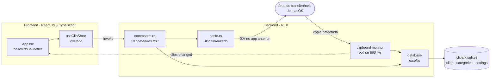

<div align="center">

<picture>
  <source media="(prefers-color-scheme: dark)" srcset="docs/assets/hero-dark.png">
  <source media="(prefers-color-scheme: light)" srcset="docs/assets/hero-light.png">
  
</picture>

<p>
  <strong>Um gerenciador de área de transferência local-first para macOS.</strong><br>
  Tudo o que você copia, em um só lugar — pesquisável, categorizado e sem nunca sair do seu Mac.
</p>

<p>
  <a href="https://github.com/LucasFernandesBrazil/ClipArk/releases/latest"></a>
  <a href="#-começando"></a>
  <a href="LICENSE"></a>
  
  
  
  
  
</p>

<p>
  <a href="#-por-que-o-clipark">Por quê</a> ·
  <a href="#baixar">Baixar</a> ·
  <a href="#-começando">Começando</a> ·
  <a href="#-funcionalidades">Funcionalidades</a> ·
  <a href="#-colagem-automática">Colagem automática</a> ·
  <a href="#-teclado">Teclado</a> ·
  <a href="#-privacidade">Privacidade</a> ·
  <a href="#-arquitetura">Arquitetura</a> ·
  <a href="#-como-contribuir">Contribuir</a>
</p>

<sub><a href="README.md">English</a> · <a href="README.pt-BR.md">Português (BR)</a></sub>

</div>

---

## 🤔 Por que o ClipArk

O macOS lembra exatamente uma coisa que você copiou. Tudo o que veio antes se perdeu.

O ClipArk guarda o resto. Aperte <kbd>⌘</kbd><kbd>⇧</kbd><kbd>V</kbd> e uma barra sobe pela
base da tela com tudo o que você copiou recentemente — pesquisável, tipado e categorizado.
Escolha um item, aperte <kbd>⏎</kbd> e ele é colado de volta direto no app em que você estava.

Não tem conta, não tem sincronização, não tem telemetria e **não tem nenhum código de
rede**. Seu histórico vive em um único arquivo SQLite na sua própria máquina, e esse é o
projeto inteiro.

<div align="center">
  
  <sub>O ClipArk não tem ícone no Dock — ele vive na barra de menus e ancora na base do monitor ativo.</sub>
</div>

---

## 🚀 Começando

### Baixar

Pegue o `.dmg` mais recente na
**[página de Releases](https://github.com/LucasFernandesBrazil/ClipArk/releases/latest)** —
um build universal só, Apple silicon e Intel, macOS 11 ou mais novo. Sem clonar, sem
toolchain.

1. Abra o `.dmg` e arraste o **ClipArk** para `Applications`.
2. Abra o app — veja [Abrindo um build não assinado](#abrindo-um-build-não-assinado)
   logo abaixo, porque o macOS vai bloquear a primeira tentativa.
3. Conceda o acesso de **Acessibilidade** quando for pedido, se quiser que o
   <kbd>⏎</kbd> cole por você.

#### Abrindo um build não assinado

O ClipArk não é assinado com um Apple Developer ID pago nem é notarizado, então a primeira
abertura é bloqueada com *"ClipArk está danificado"* ou *"não pode ser aberto porque a
Apple não consegue verificar se ele contém software malicioso"*. Nenhuma das duas mensagens
significa o que diz — significa que ninguém pagou os US$ 99 para a Apple.

Tente abrir uma vez, feche o aviso, e vá em **Ajustes do Sistema → Privacidade e
Segurança** e clique em **Abrir Assim Mesmo** na entrada do ClipArk. No macOS 15 em diante
esse é o caminho confiável; o antigo botão direito → *Abrir* nem sempre funciona mais.

Se preferir o terminal:

```bash
xattr -dr com.apple.quarantine /Applications/ClipArk.app
```

Toda release inclui um `SHA256SUMS.txt`, então dá para conferir o download antes:

```bash
shasum -a 256 -c SHA256SUMS.txt
```

> [!NOTE]
> O macOS amarra a permissão de Acessibilidade ao binário exato que a recebeu. Como os
> builds não são assinados, **pode ser necessário conceder o acesso de novo depois de
> atualizar.** Remova a entrada antiga do ClipArk em *Ajustes do Sistema → Privacidade e
> Segurança → Acessibilidade* e adicione a nova — uma entrada velha fica lá sem funcionar.

### Compilar do código-fonte

**Pré-requisitos**

| | |
|---|---|
| Node.js | 18 ou mais novo, com npm |
| Rust | toolchain estável via [rustup](https://rustup.rs) |
| Xcode CLT | `xcode-select --install` |

**Compilar e rodar**

```bash
git clone https://github.com/LucasFernandesBrazil/ClipArk.git
cd ClipArk
npm install
npm run tauri dev
```

Para gerar o bundle do app:

```bash
npm run tauri build
```

O resultado sai em `src-tauri/target/release/bundle/`. Builds locais **não são
assinados**, exatamente como os publicados — veja
[Abrindo um build não assinado](#abrindo-um-build-não-assinado).

**Primeira execução**

1. O ClipArk abre na barra de menus. Não há ícone no Dock nem entrada no ⌘-Tab — isso é
   proposital, e é justamente o que permite à colagem automática devolver o foco ao app
   anterior.
2. Aperte <kbd>⌘</kbd><kbd>⇧</kbd><kbd>V</kbd> para abrir o launcher.
3. Conceda acesso de **Acessibilidade** quando for solicitado, ou em *Settings → Pasting*.
   Sem isso o ClipArk ainda copia; ele só não consegue colar por você. Veja
   [Colagem automática](#-colagem-automática).

---

## ✨ Funcionalidades

<div align="center">
  
</div>

### Captura

- Uma thread em segundo plano consulta a área de transferência a cada **850 ms**. Por
  enquanto só texto — imagens e arquivos estão no [roadmap](#-roadmap).
- Cada item é **normalizado** (minúsculas, CRLF → LF, espaços colapsados) e passa por um
  hash **SHA-256**. O hash é uma coluna `UNIQUE`, então recopiar algo que já existe
  incrementa o contador e move o item para o começo, em vez de duplicar.
- Quando o próprio ClipArk escreve na área de transferência, ele guarda aquele hash por 3
  segundos — assim as escritas dele nunca voltam como itens novos.
- O histórico respeita o limite configurado. **Favoritos nunca são removidos pela poda.**

### Detecção de tipo

Cada item é classificado na entrada e renderizado de acordo.

| Tipo | Detectado por | Renderizado como |
|---|---|---|
| `color` | `#RGB` / `#RRGGBB` | Amostra + valor em monoespaçada |
| `email` | Formato de endereço | Texto simples |
| `url` | `http://` ou `https://` | Domínio em destaque + URL completa |
| `json` | Faz parse como JSON | Bloco monoespaçado |
| `code` | Heurística de tokens — `const `, `function `, `=>`, `import `, `fn `, `impl `, `select `, `<?php`, `</` | Bloco monoespaçado |
| `text` | Todo o resto | Prévia com quebra de linha |

### Encontrar e organizar

- A **busca** cobre o conteúdo do item, o nome do tipo e o nome da categoria, ordenando
  pelos copiados mais recentemente. Tem debounce de 110 ms para acompanhar a digitação.
- **Favoritos** com <kbd>⌘</kbd><kbd>D</kbd>, isentos da poda.
- **Categorias** com nome e cor. Clique com o botão direito em qualquer item para
  arquivá-lo. Apagar uma categoria libera os itens dela, sem apagá-los.
- Os chips de filtro alternam com <kbd>Tab</kbd>: *All → Favorites →* cada categoria.

### O launcher

<div align="center">
  
</div>

- Uma barra sem moldura e sempre no topo — 1180×320 pt, mínimo de 720×280 — ancorada 16 px
  acima do Dock no monitor ativo, centralizada e visível em todos os Spaces.
- **Vibrancy** nativa do macOS (`HudWindow`), não um blur simulado.
- Clicou fora, ela se esconde. Apertar <kbd>⌘</kbd><kbd>⇧</kbd><kbd>V</kbd> de novo com ela
  em foco também fecha.
- Os itens são cards com rolagem horizontal e snap, então a fileira é lida da esquerda para
  a direita em ordem de recência e <kbd>⌘</kbd><kbd>1</kbd>–<kbd>9</kbd> correspondem ao que
  você está vendo.

### Barra de menus

O menu da bandeja oferece **Open ClipArk**, **Pause / Resume Clipboard Tracking**,
**Settings** e **Quit**. O ícone é uma imagem *template*, então acompanha automaticamente
as barras de menu clara e escura.

---

## ⚡ Colagem automática

A funcionalidade em torno da qual o ClipArk foi construído. Apertar <kbd>⏎</kbd> não apenas
copia — coloca o conteúdo onde você estava digitando.

1. O item é escrito na área de transferência do sistema.
2. O launcher se esconde. Como o ClipArk roda como app *accessory*, o macOS reativa
   sozinho o app que estava em primeiro plano antes.
3. O ClipArk espera **120 ms** para essa transferência de foco se estabilizar.
4. Ele sintetiza um <kbd>⌘</kbd><kbd>V</kbd> como um `CGEvent`.

> [!IMPORTANT]
> O passo 4 exige permissão de **Acessibilidade** — *Ajustes do Sistema → Privacidade e
> Segurança → Acessibilidade*. O ClipArk pede na primeira vez e oferece um botão em
> *Settings → Pasting*. Nenhuma outra parte do app precisa dessa permissão.

Prefere sem isso? Desligue *Paste into the previous app on ⏎* e a tecla <kbd>⏎</kbd> volta a
apenas copiar e fechar.

### Suporte por plataforma

O ClipArk é desenvolvido e usado no macOS. O Rust compila em outros sistemas, mas as partes
que tornam o app agradável ainda não existem fora do macOS.

| | macOS | Windows | Linux |
|---|:---:|:---:|:---:|
| Histórico, busca, categorias | ✅ | ⚠️ sem testes | ⚠️ sem testes |
| Atalho global | ✅ <kbd>⌘⇧V</kbd> | <kbd>Ctrl⇧V</kbd> | <kbd>Ctrl⇧V</kbd> |
| Colagem automática | ✅ | ❌ | ❌ |
| Vibrancy da janela | ✅ | ❌ | ❌ |
| Só na barra de menus (sem Dock) | ✅ | ❌ | ❌ |

Ports são bem-vindos — veja o [CONTRIBUTING.md](CONTRIBUTING.md).

---

## ⌨️ Teclado

O launcher foi feito para ser usado sem o mouse. O campo de busca sempre mantém o foco,
então dá para começar a digitar assim que ele abre.

| Tecla | Ação |
|---|---|
| <kbd>⌘</kbd><kbd>⇧</kbd><kbd>V</kbd> | Abre o launcher — ou fecha, se já estiver em foco *(global)* |
| *digitar qualquer coisa* | Buscar |
| <kbd>←</kbd> <kbd>→</kbd> | Move a seleção |
| <kbd>Home</kbd> / <kbd>End</kbd> | Vai para o primeiro / último item |
| <kbd>⏎</kbd> | Cola o item selecionado no app anterior |
| <kbd>⌘</kbd><kbd>1</kbd>…<kbd>9</kbd> | Cola o *n*-ésimo item direto, sem selecionar antes |
| <kbd>⌘</kbd><kbd>C</kbd> | Copia a seleção sem colar |
| <kbd>⌘</kbd><kbd>D</kbd> | Marca/desmarca como favorito |
| <kbd>⌘</kbd><kbd>⌫</kbd> | Apaga o item selecionado |
| <kbd>Tab</kbd> / <kbd>⇧</kbd><kbd>Tab</kbd> | Alterna os chips de filtro |
| <kbd>⌘</kbd><kbd>F</kbd> | Foca o campo de busca |
| <kbd>Esc</kbd> | Limpa a busca → sai das configurações → esconde o launcher |

Em builds fora do macOS, <kbd>⌘</kbd> vira <kbd>Ctrl</kbd> em todos os atalhos.

**Mouse** — clique seleciona, **duplo clique cola**, botão direito abre um menu de contexto
com *Paste*, *Favourite*, *Move to category* e *Delete*. Passar o mouse sobre um card revela
os botões de favoritar e apagar. Clicar nunca rouba o foco do campo de busca.

---

## ⚙️ Configurações

<div align="center">
  
</div>

| Configuração | Padrão | O que faz |
|---|---|---|
| Paste into the previous app on ⏎ | Ligado | Desligado: <kbd>⏎</kbd> apenas copia e fecha |
| Launch ClipArk at startup | Desligado | Registra um LaunchAgent do macOS |
| Maximum stored clips | 5.000 | 500 · 1.000 · 5.000 · 10.000 · Ilimitado |
| Pause tracking | Desligado | Pausa a captura sem sair do app. Também no menu da bandeja |
| Clear history | — | Remove todos os itens. Categorias e configurações permanecem |
| Categories | — | Criar, renomear, recolorir, apagar |

---

## 🔒 Privacidade

Esta é a parte em que vale ler o código-fonte, então aqui está o que olhar.

- **Nenhum código de rede.** Não existe cliente HTTP, plugin de fetch, dependência de
  analytics nem telemetria em lugar nenhum da árvore. Pode dar `grep`.
- **Lista de permissões mínima.** O `src-tauri/capabilities/default.json` concede apenas:
  leitura/escrita de texto na área de transferência, registrar/desregistrar atalho global e
  ligar/desligar autostart. É a lista completa.
- **Nada é logado.** O conteúdo copiado nunca chega ao stdout nem a um arquivo de log.
- **Um único arquivo local**, que você pode inspecionar, salvar ou apagar:

  ```text
  ~/Library/Application Support/dev.clipark.desktop/clipark.sqlite3
  ```

> [!WARNING]
> Esse banco **não é criptografado**. Tudo o que você copia — inclusive senhas coladas de um
> gerenciador — fica em texto puro até ser podado ou você limpar o histórico. O filtro de
> conteúdo sensível está no roadmap e ainda não existe. Use *Pause tracking* quando for
> lidar com segredos. Veja o [SECURITY.md](SECURITY.md).

---

## 🏗 Arquitetura

Um núcleo em Rust cuida da área de transferência, do banco e da janela; o React cuida dos
pixels. Eles conversam pelo IPC do Tauri — 19 comandos em uma direção, 3 eventos na volta.



Outros dois módulos ficam fora desse ciclo e falam com o frontend do mesmo jeito: o
`shortcuts.rs` cuida do atalho global ⌘⇧V e do posicionamento da janela na base da tela,
emitindo `launcher-opened`; o `tray.rs` cuida da barra de menus e emite `open-settings`.

**Schema** — três tabelas em `src-tauri/migrations/001_init.sql`:

| Tabela | Colunas relevantes |
|---|---|
| `clips` | `content_hash` (UNIQUE, SHA-256), `normalized_content`, `type`, `favorite`, `category_id`, `copied_count`, `last_copied_at` |
| `categories` | `name` (UNIQUE), `color`, `icon` |
| `settings` | `key` / `value` |

Sete índices cobrem os caminhos quentes: ordenação por recência, favoritos, tipo, categoria
e busca no conteúdo normalizado.

<details>
<summary><strong>Estrutura do projeto</strong></summary>

```text
src/                          # frontend React
├── components/               # ClipCard, FilterChip, SettingsPanel, Footer, …
├── hooks/                    # useLauncherKeys, useDebouncedEffect
├── lib/                      # tauri.ts (IPC tipado), format.ts
├── stores/useClipStore.ts    # store Zustand
└── App.tsx                   # casca do launcher

src-tauri/                    # backend Rust
├── migrations/001_init.sql
├── icons/                    # ícones do app + tray.png (imagem template)
├── capabilities/default.json # lista de permissões
└── src/
    ├── clipboard/            # monitor por polling
    ├── database/             # clips, categories, settings
    ├── commands.rs           # superfície IPC
    ├── paste.rs              # colagem automática no macOS
    ├── shortcuts.rs          # atalho global + posicionamento da janela
    └── tray.rs               # barra de menus

docs/
├── assets/                   # mídias do README
└── brand/                    # masters do logo + fonte do ícone
```

</details>

---

## 🛠 Desenvolvimento

```bash
npm install            # instala as dependências do frontend

npm run tauri dev      # o app desktop completo, com hot reload
npm run dev            # só o frontend, em http://localhost:1420

npm run typecheck      # tsc --noEmit
npm run build          # tsc && vite build → dist/
cd src-tauri && cargo check
```

- A porta do dev server é fixa em **1420** — a `devUrl` do Tauri espera exatamente essa.
- O TypeScript roda em modo estrito, com `noUnusedLocals` e `noUnusedParameters`. Um import
  esquecido quebra o build.
- *Settings → Development → Seed sample clips* preenche o histórico com dados de exemplo.
  Só aparece em builds de desenvolvimento.
- **Ainda não existe suíte de testes.** Criar uma é uma primeira contribuição genuinamente útil.

**Regerando os ícones** — todos os ícones derivam de um único master 1024×1024:

```bash
npx tauri icon docs/brand/icon-master-1024.png
```

Veja [docs/brand/README.md](docs/brand/README.md) para os assets de marca e como o master e a
imagem template da barra de menus são produzidos.

---

## 🗺 Roadmap

Ideias, não promessas. Ordenadas mais ou menos pelo quanto melhorariam o uso diário.

- [ ] Busca com FTS5, no lugar do `LIKE` atual
- [ ] Suporte a imagens e arquivos
- [ ] Filtro de conteúdo sensível, para senhas nunca caírem no histórico
- [ ] Regras de exclusão por app
- [ ] Atalhos personalizáveis
- [ ] Importar / exportar
- [ ] Modo claro
- [ ] Releases assinadas e notarizadas — os downloads hoje não são assinados
- [ ] Paridade com Windows e Linux

---

## 🤝 Como contribuir

Issues e pull requests são bem-vindos. O [CONTRIBUTING.md](CONTRIBUTING.md) cobre o setup,
o estilo de código e como regerar os assets. As releases são cortadas com
`npm run release <versão>`; toda versão fica registrada no [CHANGELOG.md](CHANGELOG.md).

Uma regra molda todo o resto: **o ClipArk continua local-first.** Nada de serviços em rede,
contas, analytics ou telemetria. Uma mudança que quebre isso será recusada por melhor que
seja o código.

Ao participar, você concorda com o [Código de Conduta](CODE_OF_CONDUCT.md). Problemas de
segurança passam pelo [SECURITY.md](SECURITY.md), não pelo issue tracker público.

---

## 📄 Licença

[MIT](LICENSE) © ClipArk contributors.

<div align="center">
  <sub>Feito com <a href="https://tauri.app">Tauri&nbsp;2</a>, Rust, React e ícones
  <a href="https://lucide.dev">Lucide</a>.</sub>
</div>
